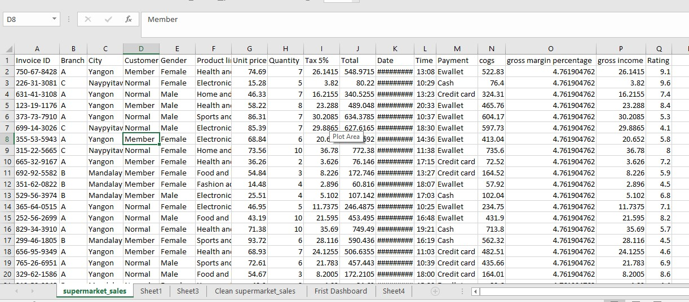
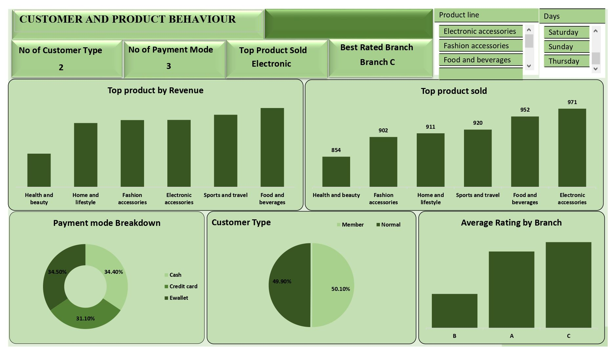
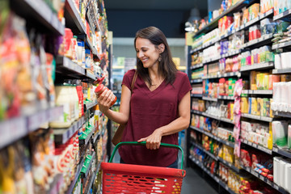

# 🛒 Supermarket Sales and Customer Behaviour Analysis

## 📌 Introduction  
This project presents an analysis of supermarket sales and customer behaviour across three branches (A, B, and C). The goal of the analysis is to evaluate **key performance indicators (KPIs)**, identify **sales trends**, understand **customer behaviour**, and assess **product performance**.  

By leveraging these insights, management can make informed decisions to boost revenue, improve customer satisfaction, and optimize operations.  

# 🗂 Dataset Overview

The dataset includes:

• Invoice ID

•	Customer demographics (gender, type and mode of payment)

•	Porduct Demo (name, Unit price and Quantity)

•	Renvenu generated

•	Tax generated

# 🛠 Tools & Techniques

•	Excel Power Query → Data cleaning
•	Excel Formulas & Functions → Data manipulation
•	Pivot Tables & Charts → Analysis
•	Excel Dashboards → Visualization

## 📊 Key Performance Overview  
- **Total Revenue:** $322,967  
- **Total Transactions:** 1,000  
- **Average Sales per Transaction:** $322.97  
- **Tax Collected:** $15,379.36  
- **Best Day for Sales:** Saturday  
- **Peak Rush Hours:** 1:00 PM – 3:00 PM  

## 📅 Sales Performance  

- **Monthly Trends:**  
  - Highest Month: **January**  
  - Lowest Month: **February**  
- **Sales by Branch:**  
  - Branch **C** → Highest sales and customer ratings  
  - Branches **A & B** → Lower sales, need improvement  
- **Sales by Day:**  
  - Strongest: **Saturday & Sunday**  
  - Weakest: **Monday & Wednesday**  
---

## 👥 Customer & Payment Behaviour  
- **Customer Types:**  
  - Members → 50.1%  
  - Normal → 49.9%  
- **Payment Modes:**  
  - E-wallet → 34.5%  
  - Cash → 34.4%  
  - Credit Card → 31.1%  

🔎 Insight: Customers are evenly split across types and payment methods, showing the importance of supporting multiple options.  

---

## 📦 Product Performance  

- **Top Product Sold (by Quantity):** Electronic Accessories (971 units)  
- **Top Product by Revenue:** Food & Beverages  
- **Other Strong Categories:** Sports & Travel, Fashion Accessories  
- **Weakest Category:** Health & Beauty  

---

## ⭐ Customer Ratings  
- Best Rated Branch: **C**  
- Moderate: **A**  
- Lowest: **B**  

---

## 🔑 Key Insights  
1. Sales peak on **weekends** and **afternoons (1–3 PM)**.  
2. **Branch C** leads in sales and satisfaction.  
3. **Food & Beverages + Electronics** are strongest categories.  
4. Customer loyalty program is balanced and effective.  
5. Payment preferences are **diverse** and nearly equal.  

---

## ✅ Recommendations  
- Introduce **weekday promotions** (Monday & Wednesday).  
- Improve **Branch B’s operations** (training, layout, service).  
- Focus on **Food & Beverages and Electronics** with bundles & promotions.  
- Enhance **loyalty program rewards** to retain members.  
- Align promotions with **peak times (weekends, 1–3 PM)**.  
- Run **February campaigns** to improve seasonal dips.  
- Boost **Health & Beauty** through marketing and discounts.
- Assign more staff during **peak hours** for faster service and to reduce **customer waiting times**.
- Place **fast-moving items** near checkout to increase **impulse purchases**.

---

## 🏁 Conclusion  

The supermarket generated **$322,967** in revenue from **1,000 transactions**, showing solid performance. Branch C sets the benchmark in both sales and customer satisfaction, while Branch B requires strategic attention. Leveraging high-performing categories and addressing weaker areas will ensure **balanced growth and improved customer experience**.  

---

## 📂 Repository Structure  
